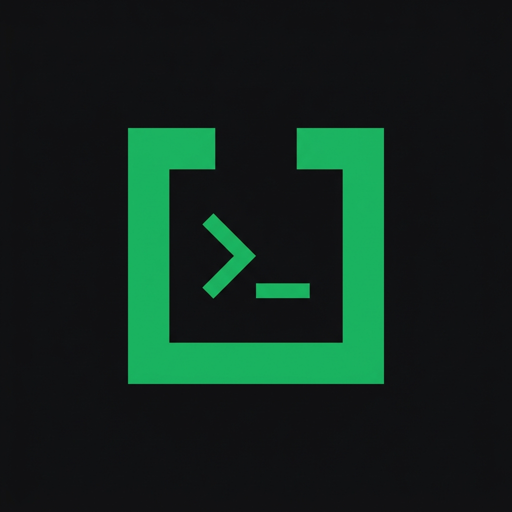

<div align="center">
  
  <h1>⚡ uShell</h1>
  <p><b>Ultra-Minimalist Geek SSH & SFTP Desktop Client</b></p>
  <p>专为开发者与运维工程师打造的极简、无边框、支持 AI 智能辅助的跨平台现代桌面客户端。</p>

  <p>
    <a href="https://aucf.github.io/ushell/"></a>
    <a href="https://github.com/AuCf/ushell/stargazers"></a>
    <a href="https://github.com/AuCf/ushell/releases"></a>
    <a href="https://github.com/AuCf/ushell/releases/latest"></a>
    <a href="LICENSE"></a>
  </p>

  <p>
    
    
    
    
  </p>
</div>

---

## 📸 界面预览 (Screenshots)

<div align="center">
  <p><b>VT100 PTY 交互终端与极速主机会话</b></p>
  
  <br/><br/>
  <p><b>双向 SFTP 文件管理器 & AI 排错 Copilot</b></p>
  
</div>

---

## 🌟 为什么选择 uShell？

大多数传统 SSH 客户端界面繁复或风格过时。**uShell** 采用类似 **Ghostty / Neovim** 的超极简暗黑极客风格设计，剥离了一切臃肿装饰，结合 **Tauri v2 (Rust)** 带来轻量高效的桌面终端体验。

- ⚡ **瞬时启动**：基于 Tauri v2 原生系统调用，资源占用降低 80%。
- 🎨 **极客暗黑终端绿**：极简平滑界面与防疲劳经典绿配色。
- 🤖 **AI Copilot**：报错智能抓取排障与指令一键插入。
- 🔄 **无缝迁移**：一键导入外部 JSON 节点配置与纯文本 IP 列表。
- 🚀 **自动热更新**：内置 GitHub Auto-Updater，新版本推送时左上角自动闪烁小黄点。

---

## ✨ 核心特性

- 🖼️ **全无边框极客设计 (Frameless Window)**
  - 去除原生白框标题栏，内置集成原生最小化、最大化与关闭按钮，拖拽区与主界面无缝融为一体。
- 🖥️ **VT100 PTY 终端内核 (xterm.js PTY Stream)**
  - 真正基于 Rust `ssh2` + Webview Channel 的双向 PTY 数据流通道。支持 ANSI 全彩高亮、Tab 键智能补全、历史命令 (`↑`/`↓`) 导航与上下文右键操作。
- 📁 **双向 SFTP 文件管理器 (Ranger Style)**
  - 支持本地文件/文件夹拖拽上传、双向穿梭传输、隐藏文件/点文件 (`.dotfiles`) 开关切换、在线新建目录与下载。
- 🤖 **AI 命令行助手与智能排错 (AI Copilot & Error Diagnoser)**
  - 集成 DeepSeek / OpenAI / Claude / 本地 Ollama 模型。支持左右对比对话气泡、清空历史会话、报错自动精准捕获与指令一键填入终端 (RUN IN TERM)。
- 🔄 **第三方终端配置一键导入 (External Config Importer)**
  - 无缝解析通用 JSON 配置文件或纯文本 IP 节点列表 (`root@192.168.1.1:22`)。
- 🎨 **黑白极客双主题 (Dark / Light Theme)**
  - ☀️ 日间清爽模式与 🌙 暗黑极客模式一键切换，全组件自适应高对比度显示。
- 🌐 **中英文双语支持 (Full i18n)**
  - 顶栏一键切换中英文界面文案。

---

## 📦 客户端下载 (v0.0.6 Releases)

您可以在 [GitHub Releases](https://github.com/AuCf/ushell/releases/latest) 下载适用于您系统的安装包：

| 操作系统 | 芯片架构 | 安装包类型 | 文件格式 |
| :--- | :--- | :--- | :--- |
| **Windows** | x86_64 / x64 | Windows 安装包 / MSI | `.exe` / `.msi` |
| **macOS** | Apple Silicon (M1/M2/M3/M4) | Apple 芯片原生 DMG | `.dmg` (aarch64) |
| **macOS** | Intel | Intel 芯片原生 DMG | `.dmg` (x86_64) |

---

## 🚀 开发者指南 (Developer Guide)

### 前置要求

- [Node.js](https://nodejs.org/) (>= 18.0)
- [Rust Toolchain](https://www.rust-lang.org/) (Cargo & rustc)

### 本地开发 (Dev Mode)

```bash
# 1. 克隆项目
git clone https://github.com/AuCf/ushell.git
cd ushell

# 2. 安装依赖
npm install

# 3. 启动开发调试模式 (支持 HMR 热更新)
npm run tauri:dev
```

### 一键流水线发布 (One-Command Release)

```bash
# 自动递增版本号、同步所有配置、Git Commit & Tag 并一键 Push 触发 GitHub Actions 云打包
npm run release
```

---

## 🛠️ 技术栈 (Tech Stack)

- **桌面运行时**: [Tauri v2](https://tauri.app) (Rust)
- **前端框架**: [React 18](https://reactjs.org) + [TypeScript](https://www.typescriptlang.org)
- **构建工具**: [Vite 5](https://vitejs.dev)
- **样式方案**: [TailwindCSS 3](https://tailwindcss.com)
- **终端引擎**: [@xterm/xterm](https://xtermjs.org) + `@xterm/addon-fit`
- **图标库**: [Lucide React](https://lucide.dev)

---

## 📜 开源协议 (License)

本项目基于 [MIT License](LICENSE) 协议开源。
