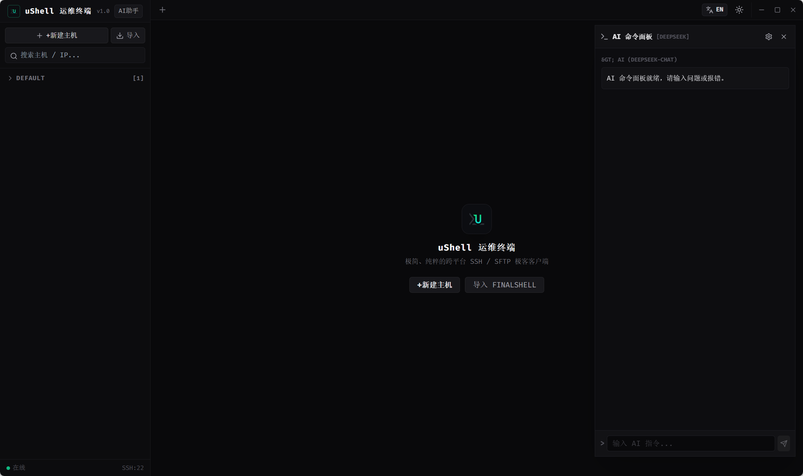
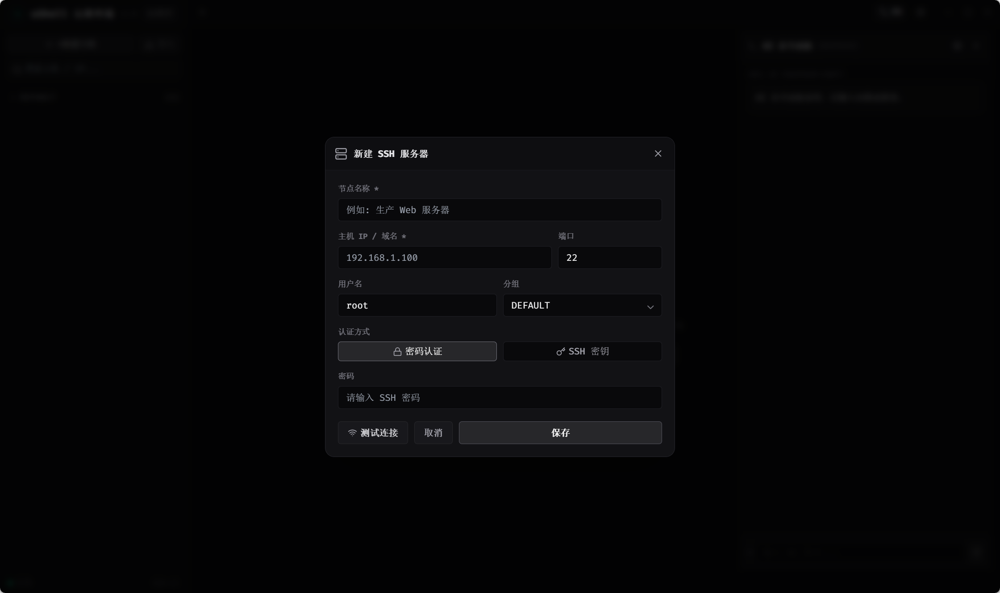

# ⚡ uShell

> **Ultra-Minimalist Geek SSH & SFTP Desktop Client**  
> 专为开发者与运维工程师打造的极简、无边框、支持 AI 辅助的跨平台 FinalShell 替代品。

🌐 **官方网站 (Official Website)**: [docs/index.html](docs/index.html)

[](https://tauri.app)
[](https://reactjs.org)
[](https://www.typescriptlang.org)
[](LICENSE)

---

## 🌟 为什么选择 uShell？

大多数传统 SSH 客户端（如 FinalShell、Xshell）界面繁复或风格过时。**uShell** 采用类似 **Ghostty / Neovim** 的超极简暗黑极客风格设计，剥离了一切臃肿装饰，结合 **Tauri v2 (Rust)** 带来轻量高效的桌面终端体验。





---

## ✨ 核心特性

- 🖼️ **全无边框极客设计 (Frameless Window)**
  - 去除了 Windows 原生白框标题栏，集成原生 `-` 最小化、`□` 最大化、`✕` 关闭窗口按钮与拖拽区域。
- 🖥️ **VT100 PTY 终端内核 (@xterm/xterm)**
  - ANSI 全彩渲染、历史命令 (`↑`/`↓`) 导航、`pwd` / `cd` 动态路径指示、`Ctrl+C` 中断与选中文本复制、`Ctrl+V` 粘贴、鼠标右键上下文菜单。
- 📁 **Ranger 风双视图 SFTP 文件管理器**
  - 目录树穿梭、`+MKDIR` 新建文件夹、文件传输与实时进度条。
- 🤖 **AI 命令行助手与智能排错 (AI Copilot & Error Diagnoser)**
  - 快捷键 `AI:Cmd` 面板，已接入 **DeepSeek / OpenAI / Claude / 本地 Ollama** 大模型 API；支持终端报错一键分析与指令“一键填入终端 (RUN IN TERM)”。
- 🔄 **FinalShell 配置一键导入 (FinalShell Importer)**
  - 无缝解析 FinalShell `conn.json` 文件或纯文本 IP 节点列表 (`root@192.168.1.1:22`)。
- 🎨 **黑白极客双主题 (Dark / Light Theme)**
  - ☀️ 日间清爽模式与 🌙 暗黑极客模式一键切换，全局组件自适应。
- 🌐 **中英文双语支持 (Full i18n)**
  - 顶栏 `EN` ↔ `中` 一键无缝切换全局文案。
- 🔒 **Rust 原生 TCP Socket 连通性校验 (Native Rust SSH Tester)**
  - 调用 Rust 底层发起 5s 原生 Socket 握手与 `SSH-2.0-OpenSSH` 真实 Header 识别，严格拦截伪造 IP/无效凭据。
- 💾 **100% 本地数据持久化 (Persistent Storage)**
  - 所有主机配置、自定义分组列表、AI API Key 密钥及界面偏好全部加密持久化存于本地。

---

## 📦 客户端下载

您可以直接从 `releases` 目录获取已编译的 Windows 独立客户端：

| 文件名 | 类型 | 说明 |
| :--- | :--- | :--- |
| **`ushell.exe`** | 绿色免安装版 | 直接双击即可运行 |
| **`uShell_0.0.1_x64-setup.exe`** | NSIS 安装包 | 标准 Windows 安装向导 |
| **`uShell_0.0.1_x64_en-US.msi`** | MSI 安装包 | 企业级 MSI 部署包 |

---

## 🚀 开发者指南 (Developer Guide)

### 前置要求

- [Node.js](https://nodejs.org/) (>= 18.0)
- [Rust Toolchain](https://www.rust-lang.org/) (Cargo & rustc)

### 本地开发 (Dev Mode)

```bash
# 1. 克隆项目
git clone https://github.com/AuCf/ushell.git
cd ushell

# 2. 安装依赖
npm install

# 3. 启动开发调试模式 (支持 HMR 热更新)
npm run tauri:dev
```

### 生产打包 (Production Build)

```bash
# 编译 Vite 前端并构建 Tauri 原生可执行程序
npm run build
npx tauri build
```

打包生成的 `.exe` 与安装包将放置于 `src-tauri/target/release/` 目录。

---

## 🛠️ 技术栈 (Tech Stack)

- **桌面运行时**: [Tauri v2](https://tauri.app) (Rust)
- **前端框架**: [React 18](https://reactjs.org) + [TypeScript](https://www.typescriptlang.org)
- **构建工具**: [Vite 5](https://vitejs.dev)
- **样式方案**: [TailwindCSS 3](https://tailwindcss.com)
- **终端引擎**: [@xterm/xterm](https://xtermjs.org) + `@xterm/addon-fit`
- **图标库**: [Lucide React](https://lucide.dev)

---

## 📜 开源协议 (License)

本项目基于 [MIT License](LICENSE) 协议开源。
